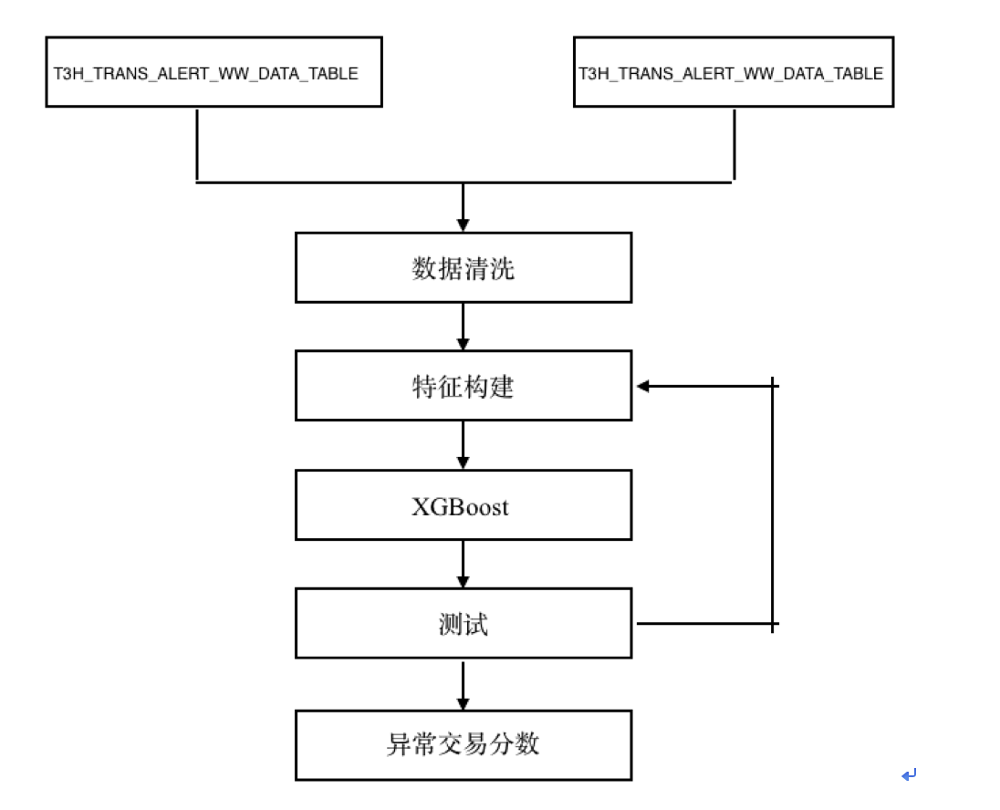
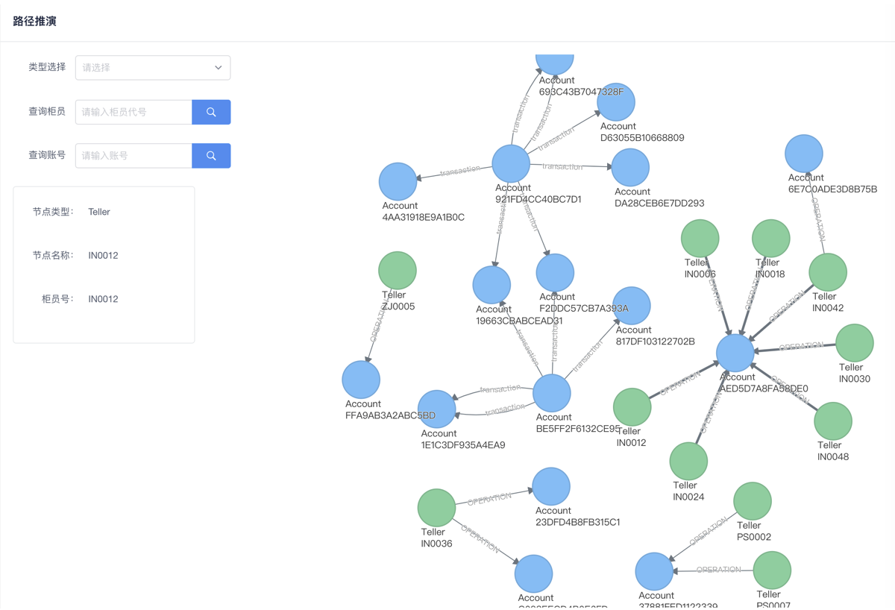
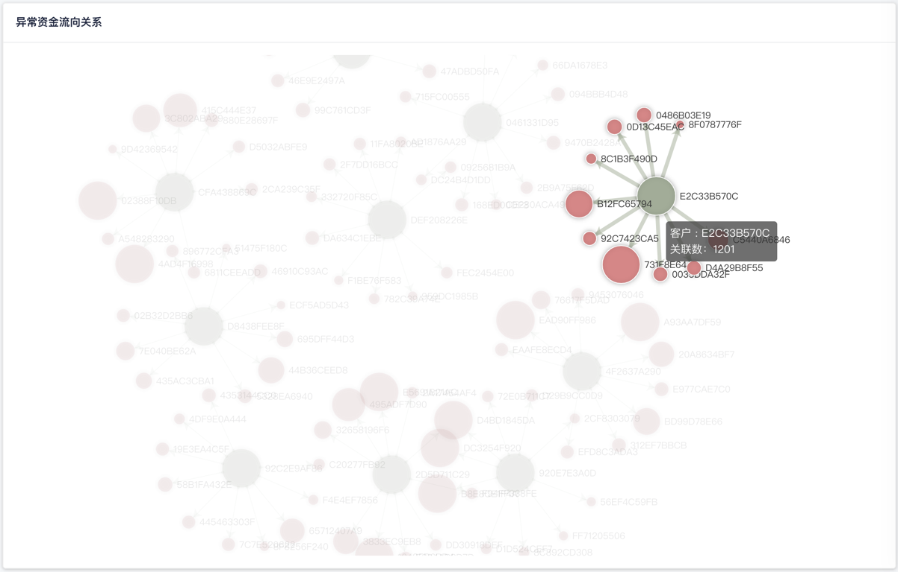

## 异常账户检测及评分算法
该算法采用监督式学习，银行流水的数据为输入，是否为已上报数据为类别标签。经过数据清洗，特征构造，Smote采样，随机森林分类和预测等模型和技术，给出异常账号的异常分数。

### 数据源
- T3H_TRANS_ALERT_WW_DATA_TABLE
- T3H_TRANS_YSB_WW_DATA_TABLE

### 算法主要流程

## 异常账户检测及评分算法
该算法采用监督式学习，银行流水的数据为输入，是否为已上报数据为类别标签。经过数据清洗，特征构造，XGBoost异常检测和预测等模型和技术，给出异常交易的异常分数。

### 数据源
- T3H_TRANS_ALERT_WW_DATA_TABLE
- T3H_TRANS_YSB_WW_DATA_TABLE

### 算法主要流程

## 知识图谱

### 数据源
- 柜员参数表（F_CM_KTLP_GYCSHU）
- 反洗钱系统交易流水表（T2A_TRANS）
- 负债账户信息表（F_AG_DP_KDPA_ZHXINX）

1. 主要节点及关系
课题组建立的知识图谱中包含的节点有柜员、客户、账户；包含的关系有交易、操作、拥有，其中，客户与客户实体之间存在交易流水即建立交易关系，交易关系具有交易时间、交易金额属性；柜员实体为客户实体办理业务即建立操作关系；客户实体使用过账号实体进行交易即建立拥有关系。

2. 应用场景示例
    - 资金回流
    - 可疑团伙作案

### screenshots

### 现场知识图谱创建
1. 在30机器上，xianchang 文件夹下，运行 jupyter notebook
2. 打开 create_csv.ipynb 文件，从头运行到尾，生成实体和关系的所有CSV文件
    - **注意修改 save_transaction_rela 函数，新的函数在 graph_score.ipynb 文件里**
3. 创建完 csv 文件后，将所有的 csv 文件 从30机器 scp 到 40 机器
4. 在 40 机器上，进入neo4j的docker 主目录
    - 停止 neo4j.  (./bin/neo4j stop)
    - 删除已有的数据库 (rm -rf data/database/graph.db) 
5. 退出 neo4j 的 docker
6. docker cp 命令，将 40 机器上所有 csv 文件上传到neo4j docker import 目录
7. 在 40 机器上，进入neo4j的docker主目录
    - 利用 import-admin 工具，生成知识图谱
    > ./bin/neo4j-admin import --nodes import/customer.csv --nodes import/teller.csv --nodes import/account.csv --nodes import/hall.csv --relationships import/belongTo.csv --relationships import/transaction.csv --relationships import/beOperated.csv --ignore-missing-nodes
8. 重启neo4j (./bin/neo4j restart)
9. 退出docker, 重启docker. (docker restart .... )

### 运行知识图谱
- 将上传到gitlab repo里的 graph_score.ipynb 文件拷贝到30机器上,现场目录下。
    - **修改neo4j数据库的接口,(ip 和 密码）**
    - 将监督学习的结果（supervised_result.pkl 和 predicted_label.pkl）放到30机器上，现场目录下。
    - 同理放入非监督学习的结果
- 分别运行三个算法，得到三个算法的结果。